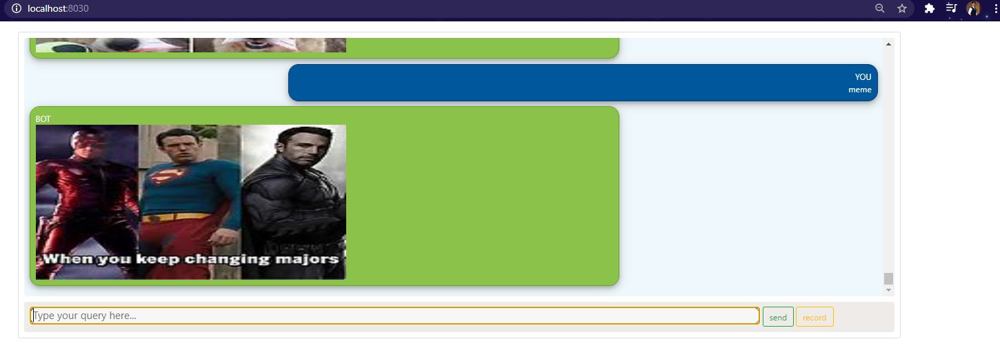

# CHATBOT FOR INSOMNIA PATIENTS
- A Chatbot which uses intent based model for interacting with a user. Type in joke/meme or [anything] video/play, which its scrapes from websites and displays to the user.
- Used - nltk, tensorflow, tflearn, Django, Beautifulsoup

